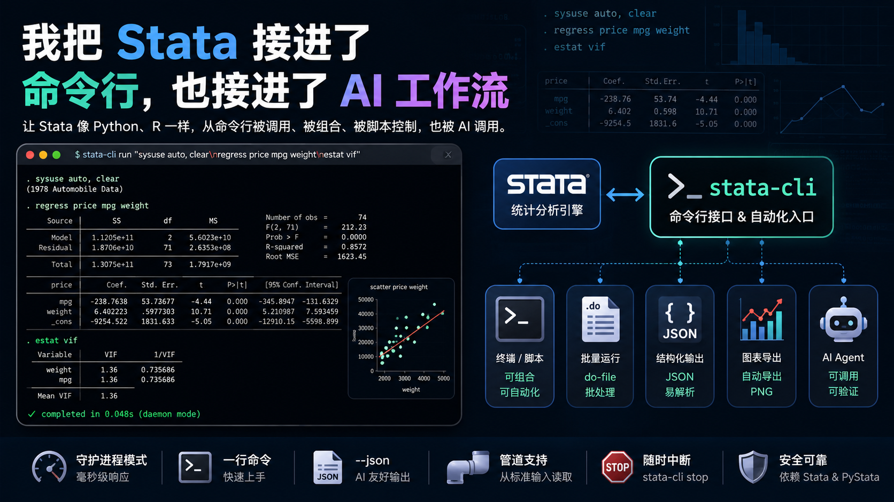

# stata-cli



[](https://opensource.org/licenses/MIT)
[](https://www.python.org/)
[](https://www.npmjs.com/package/stata-cli)

[中文版](README.zh.md) | [English](README.md)

A command-line interface for [Stata](https://www.stata.com/) via PyStata — built for humans and AI Agents. Run Stata code, `.do` files, view data, get help, and export graphs, all from the terminal. Includes a daemon mode for sub-second execution.

[Install](#installation--quick-start) · [AI Agent](#quick-start-ai-agent) · [Commands](#commands) · [Daemon](#daemon-mode) · [Advanced](#advanced-usage) · [Contributing](#contributing)

## Why stata-cli?

- **Agent-Native Design** — Structured JSON output, exit codes, and a [SKILL.md](SKILL.md) definition out of the box — AI Agents can operate Stata with zero extra setup
- **Sub-Second Execution** — Daemon mode keeps PyStata alive in the background, reducing startup from ~2-3s to ~85ms (35x speedup)
- **Full Coverage** — Run code, execute `.do` files, view data, browse help, export graphs, interrupt execution — everything you need from one binary
- **AI-Friendly & Optimized** — Compact output mode, token limit management, structured JSON responses, and graph auto-naming — designed for Agent tool-use
- **Open Source, Zero Barriers** — MIT license, ready to use, just `pip install`
- **Up and Running in Seconds** — Auto-detects your Stata installation, from install to first command in 2 steps

## Features

| Category | Capabilities |
|----------|-------------|
| **Run Code** | Execute inline Stata code, multi-line blocks, or pipe from stdin |
| **Do Files** | Run `.do` files with `///` line continuation support and graph auto-naming |
| **Data Viewer** | View current dataset as JSON with `if`-condition filtering and row limits |
| **Help System** | Browse Stata help topics with SMCL-to-plain-text conversion |
| **Graph Export** | Auto-detect and export graphs as PNG to `~/.stata-cli/graphs/` |
| **Daemon Mode** | Persistent background process for sub-second execution via Unix socket |
| **Output Control** | Compact mode, JSON output, token limit management with full-output file save |
| **Interruption** | Send break signal to stop long-running commands |

## Installation & Quick Start

### Requirements

- **Stata 17+** installed on your machine (provides the PyStata library)
- Python 3.10+

### Quick Start (Human Users)

#### Install

Choose **one** of the following methods:

**Option 1 — From pip (recommended):**

```bash
pip install stata-cli
```

**Option 2 — From npm / npx (zero Python setup):**

```bash
# One-shot usage
npx stata-cli run "display 1+1"

# Global install
npm install -g stata-cli
```

The npm package is a thin wrapper that delegates to `uvx`, `pipx`, or `python3`.

**Option 3 — From source:**

```bash
git clone https://github.com/ashuiGordon/stata-cli.git
cd stata-cli
pip install -e ".[data]"
```

#### Use

```bash
# 1. Verify Stata is detected
stata-cli detect

# 2. Run your first command
stata-cli run "display 1+1"

# 3. Start daemon for fast execution
stata-cli daemon start
stata-cli run "sysuse auto, clear"    # ~85ms!
```

## Quick Start (AI Agent)

> The following steps are for AI Agents calling `stata-cli` via the Bash tool.

**Step 1 — Install**

```bash
pip install stata-cli
```

**Step 2 — Verify Stata path**

```bash
stata-cli detect
```

**Step 3 — Start daemon (recommended)**

```bash
stata-cli daemon start
```

**Step 4 — Run commands**

```bash
# Inline code
stata-cli run "sysuse auto, clear
regress price mpg weight
predict yhat"

# Structured JSON output
stata-cli --json run "summarize price"

# View data
stata-cli data --if "price>10000" --rows 50

# Lookup command syntax
stata-cli help regress
```

## Commands

### `run` — Execute Stata Code

```bash
stata-cli run "sysuse auto, clear"

# Multi-line
stata-cli run "sysuse auto, clear
summarize price mpg
regress price mpg weight"

# Pipe from stdin
echo "display 42" | stata-cli run -
```

### `do` — Execute a .do File

```bash
stata-cli do analysis.do
stata-cli --compact do long_script.do
```

Do files are preprocessed: `///` line continuations are joined, and unnamed graph commands are auto-named for reliable export.

### `data` — View Current Dataset

```bash
stata-cli data
stata-cli data --if "price>5000" --rows 50
```

Returns the current dataset as JSON with columns, data, types, and row counts.

### `help` — Browse Stata Help

```bash
stata-cli help regress
stata-cli help summarize
```

Displays help as plain text (SMCL markup is automatically converted).

### `stop` — Interrupt Execution

```bash
stata-cli stop
```

Sends a break signal to the running Stata command (daemon mode).

### `detect` — Find Stata Installation

```bash
stata-cli detect
```

Prints the auto-detected Stata installation path.

## Daemon Mode

The daemon keeps PyStata alive in the background — reduces execution time from **~2-3s to ~85ms** (35x speedup).

```bash
stata-cli daemon start       # Start background daemon
stata-cli run "display 1"    # Fast — auto-routes through daemon
stata-cli daemon status      # Check daemon state (PID, uptime, idle)
stata-cli daemon restart     # Clean restart (reset Stata state)
stata-cli daemon stop        # Shut down
```

| Command | Description |
|---------|-------------|
| `daemon start` | Start the background daemon process |
| `daemon stop` | Graceful shutdown |
| `daemon status` | Show PID, Stata path, uptime, idle time |
| `daemon restart` | Stop + start (clean Stata state) |

Commands auto-route through the daemon when it is running. Use `--no-daemon` to force direct execution.

The daemon auto-shuts down after 1 hour of inactivity (configurable with `--idle-timeout`).

## Advanced Usage

### Global Options

| Option | Description | Default |
|--------|-------------|---------|
| `--stata-path PATH` | Stata installation directory | auto-detected |
| `--edition [mp\|se\|be]` | Stata edition | `mp` |
| `--compact` | Strip verbose output noise | off |
| `--json` | Structured JSON output | off |
| `--timeout SECONDS` | Execution timeout | 600 |
| `--max-tokens N` | Max output tokens (0=unlimited) | 0 |
| `--no-daemon` | Force direct execution | off |
| `--graphs-dir PATH` | Graph export directory | `~/.stata-cli/graphs/` |

### JSON Output

```bash
stata-cli --json run "display 1+1"
```

```json
{
  "success": true,
  "output": ". display 1+1\n2",
  "error": "",
  "execution_time": 0.04,
  "return_code": 0,
  "extra": {}
}
```

| Field | Type | Description |
|-------|------|-------------|
| `success` | bool | Whether the command succeeded |
| `output` | string | Stata output text |
| `error` | string | Error message (if any) |
| `execution_time` | float | Seconds elapsed |
| `return_code` | int | Stata r-code (0 = ok) |
| `extra` | dict | May contain `graphs` list with exported file paths |

### Graph Export

When Stata code creates graphs, they are automatically detected and exported as PNG:

```bash
stata-cli run "sysuse auto, clear
scatter price mpg"
```

```
[graph] graph1: /Users/you/.stata-cli/graphs/exec-.../graph1.png
```

In JSON mode, graph paths appear under `extra.graphs`.

### Token Limit Management

For long outputs, use `--max-tokens` to truncate and save the full output to a file:

```bash
stata-cli --max-tokens 500 run "sysuse auto, clear
describe"
```

When output exceeds the limit, a preview is shown with a path to the full saved output.

### Environment Variables

| Variable | Description |
|----------|-------------|
| `STATA_PATH` | Override Stata installation path |
| `STATA_CLI_GRAPHS_DIR` | Override graph export directory |

### Exit Codes

| Code | Meaning |
|------|---------|
| 0 | Success |
| 1 | Stata command error |
| 2 | CLI usage error |
| 3 | Stata not found / init failure |

## Agent Usage Pattern

```bash
# Full analysis workflow
stata-cli run "sysuse auto, clear
summarize price mpg
regress price mpg weight
predict yhat
list make price yhat in 1/5"

# Check data after loading
stata-cli data --if "price>10000"

# Lookup command syntax
stata-cli help anova

# Compact mode for less noise
stata-cli --compact run "sysuse auto, clear
describe"

# JSON mode for structured parsing
stata-cli --json run "display 1+1"
```

## Contributing

Community contributions are welcome! If you find a bug or have feature suggestions, please submit an [Issue](https://github.com/ashuiGordon/stata-cli/issues) or [Pull Request](https://github.com/ashuiGordon/stata-cli/pulls).

For major changes, we recommend discussing with us first via an Issue.

## License

This project is licensed under the **MIT License**.
